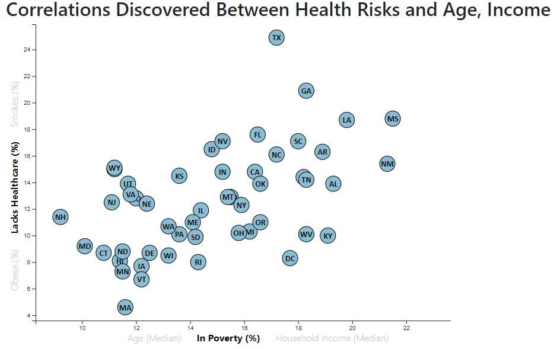

# D3 Interactive Scatterplot

## Overview and Notes

In the following readme there are animated gifs that show the basic expectations of the final design. The screenshot of the final product is not animated but can be [found here](https://gitjudd.github.io/D3-challenge/) I originally designed the layout with the d3-tip.js plugin developed by Justin Palmer as shown. While testing the design on a mobile view, it felt cramped so I extended the viewing by reducing the x and y label stacks to more of an inline view type.

## Background

Analyze the current trends shaping people's lives in reguard to health risks facing particular demographics. Create charts, graphs, and interactive elements to help readers understand the findings.

The data set used is based on 2014 ACS 1-year estimates: [https://factfinder.census.gov/faces/nav/jsf/pages/searchresults.xhtml](https://factfinder.census.gov/faces/nav/jsf/pages/searchresults.xhtml), The data set includes data on rates of income, obesity, poverty, etc. by state. MOE stands for "margin of error."
Update - American FactFinder has been decommissioned and is no longer available. Data now available at: [https://data.census.gov/cedsci/table?q=2014%20ACS&tid=ACSDP1Y2014.DP05&hidePreview=false](https://data.census.gov/cedsci/table?q=2014%20ACS&tid=ACSDP1Y2014.DP05&hidePreview=false)

## Requirements

* Create a scatter plot between two of the data variables.

* Use D3 to pull the data from the exported csv using D3.csv

* Include state abbreviations in the circles.

* Create and situate your axes and labels to the left and bottom of the chart.

* The final scatter plot should ultimately appear similar to the example image at the top of this section.

- - -

### Considerations

* Animated scatter plot preferred.

* Maximize the visualization by including multiple labels on a single plot with click events so that users can decide which data to compare in the display.

* Animate the transitions for the circles' locations.

* Use the `d3-tip.js` plugin developed by [Justin Palmer](https://github.com/Caged) to incorporate tooltips.

#### Screenshot

